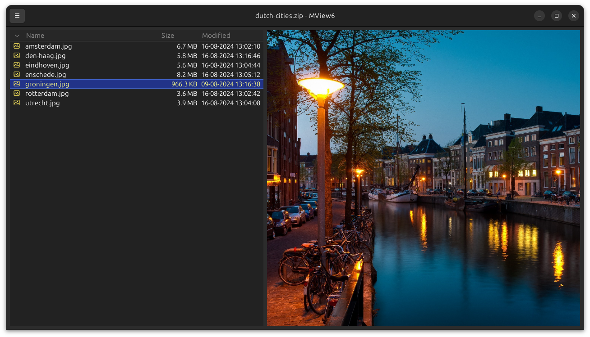
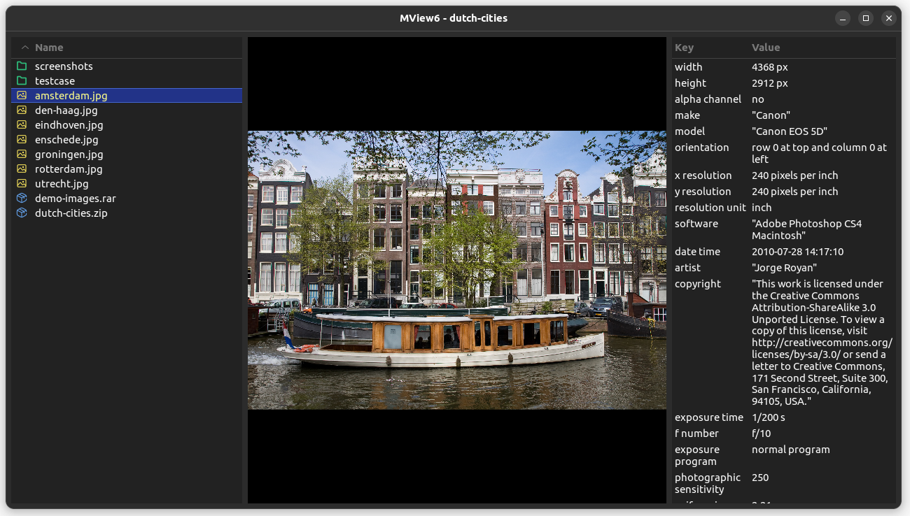
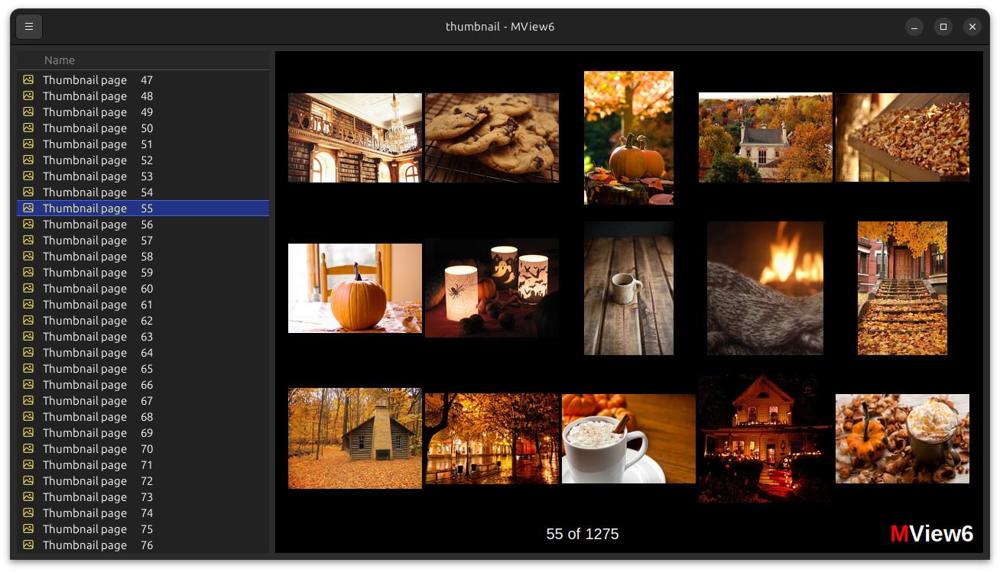

# MView6

[![GitHub Actions Workflow Status][build-badge]][build-url]
[![GitHub Release][release-badge]][release-url]

[build-badge]: https://img.shields.io/github/actions/workflow/status/newinnovations/MView6/release.yml?logo=github
[build-url]: https://github.com/newinnovations/MView6/actions/workflows/release.yml
[release-badge]: https://img.shields.io/github/v/release/newinnovations/MView6?logo=github
[release-url]: https://github.com/newinnovations/MView6/releases

**A high-performance PDF and photo viewer built with Rust and GTK4**

MView6 is designed for people who work with large photo and document collections.
It provides seamless browsing across directories and archives, combining powerful features with an intuitive interface optimized for efficient operation.
Built on modern, performance-focused technologies such as Rust and GTK4.

## Key Features

### Archive Integration

- Native support for ZIP and RAR archives - view contents without extraction
- Seamless navigation between directories and compressed files
- Maintains viewing context when switching between different sources

### Image & Document Handling

- Comprehensive image and document format support including
  - PDF, EPUB
  - JPEG, PNG, SVG, HEIC, AVIF
  - Animated GIF and WEBP
  - ... and more
- Advanced zoom controls including max-scale, fit-to-window and actual size
- Dual-page PDF view mode for reading books and magazines
- Image and document rotation with 90-degree increments
- Complete EXIF metadata display including camera settings and GPS data

### Navigation & Interface

- Full keyboard navigation
- Intuitive mouse controls with scroll-wheel zooming and drag panning
- Multi-size thumbnail view for quick collection overview
- Keeps track of navigation positions across directory changes

### Organization Tools

- Tagging images for favorites and deletion candidates
- Sorting options on type, status, name and data
- Thumbnail presentation

## Installation

Pre built binaries for Ubuntu (.deb) and Windows (.msi) can be downloaded from the Github [releases](https://github.com/newinnovations/MView6/releases) page.

## Screenshots

## Use Cases

**Document Reading** - Read PDFs, digital magazines, and e-books with single and dual-page layout.

**Research and Reference** - Browse image collections for academic, creative, or professional reference.

**Photography Workflow** - Review and organize large photo collections with metadata analysis.

**Digital Asset Management** - Navigate complex directory structures and archived assets.

## Contributing

MView6 is developed in Rust with GTK4. Contributions are welcome through pull requests and issue reports.

## License

MView6 is free software: you can redistribute it and/or modify it under the terms of
the GNU Affero General Public License as published by the Free Software Foundation, either
version 3 of the License, or (at your option) any later version.
