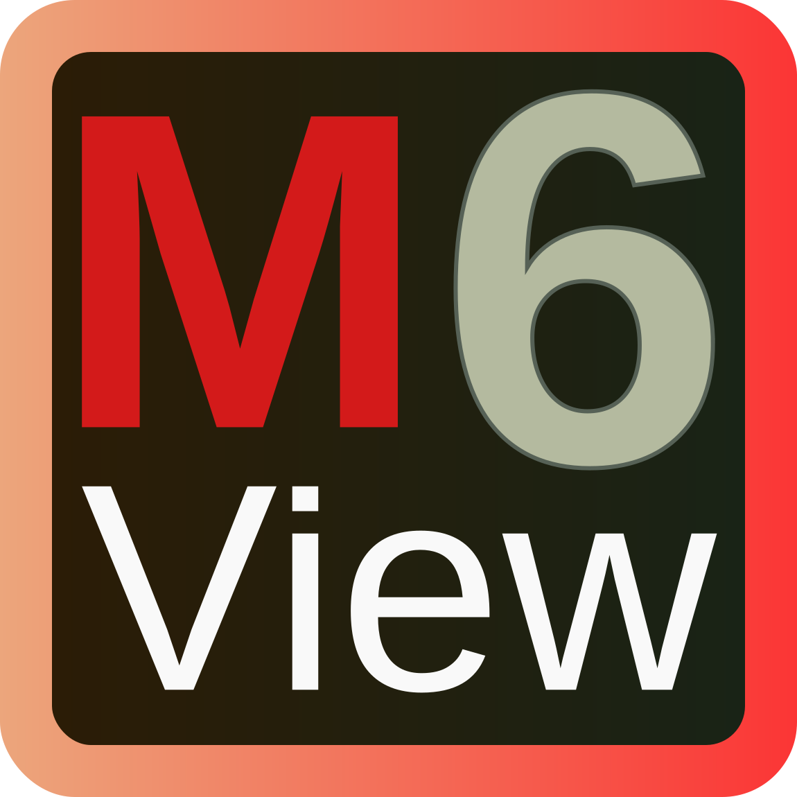

# MView6



[![Built with Rust][built-with-badge]][built-with-url]
[![GitHub Actions Workflow Status][build-badge]][build-url]
[![GitHub Release][release-badge]][release-url]

[built-with-badge]: https://img.shields.io/badge/built_with-Rust,_GTK4_and_PDFium--rs-darkgreen?logo=rust
[built-with-url]: https://github.com/newinnovations/pdfium-rs
[build-badge]: https://img.shields.io/github/actions/workflow/status/newinnovations/MView6/release.yml?logo=github
[build-url]: https://github.com/newinnovations/MView6/actions/workflows/release.yml
[release-badge]: https://img.shields.io/github/v/release/newinnovations/MView6?logo=github
[release-url]: https://github.com/newinnovations/MView6/releases

**A high-performance PDF and photo viewer built with Rust and GTK4**

MView6 is designed for people who work with large photo and document collections.
It provides seamless browsing across directories and archives, combining powerful features with an intuitive interface optimized for efficient operation.
Built on modern, performance-focused technologies such as Rust and GTK4.

## Key Features

### Archive Integration

- Native support for ZIP and RAR archives - view contents without extraction
- Seamless navigation between directories and compressed files
- Maintains viewing context when switching between different sources

### Image & Document Handling

- Comprehensive image and document format support including
  - PDF, EPUB
  - JPEG, PNG, SVG, HEIC, AVIF
  - Animated GIF and WEBP
  - ... and more
- Advanced zoom controls including max-scale, fit-to-window and actual size
- Dual-page PDF view mode for reading books and magazines
- Image and document rotation with 90-degree increments
- Complete EXIF metadata display including camera settings and GPS data

### Navigation & Interface

- Full keyboard navigation
- Intuitive mouse controls with scroll-wheel zooming and drag panning
- Multi-size thumbnail view for quick collection overview
- Keeps track of navigation positions across directory changes

### Organization Tools

- Tagging images as `liked` or `disliked` (deletion candidates)
- Sorting options on type, status, name and data
- Thumbnail presentation

## Installation

### Pre-built Binaries

#### Windows

1. Download the latest `.msi` installer from the [releases page](https://github.com/newinnovations/MView6/releases)
2. Run the installer by double-clicking the downloaded file

**Important:** The Windows installer is currently unsigned. You may see a security warning when running the installer.
This is expected and safe, the code is compiled and the installer is automatically created by Github using Github Actions.
The warning appears because we haven't purchased a code signing certificate.
To proceed:

- If you see "Windows protected your PC", click **More info** then **Run anyway**
- Some antivirus software may flag unsigned executables - this is a false positive

#### Ubuntu/Debian

1. Download the latest `.deb` package from the [releases page](https://github.com/newinnovations/MView6/releases)
2. Install using your package manager:

   ```bash
   sudo dpkg -i mview6_*.deb
   sudo apt-get install -f  # Install any missing dependencies
   ```

Alternatively, you can double-click the `.deb` file to install through your desktop environment's package installer.

### Building from Source

### Prerequisites

- Rust (latest stable version)
- GTK4 development libraries
- Additional system dependencies may be required

#### Build and Install

```bash
git clone https://github.com/newinnovations/MView6.git
cd MView6
cargo build --release
cargo install --path .
```

The binary will be installed to `~/.cargo/bin/mview6` (ensure this directory is in your PATH).

### System Requirements

- **Windows:** Windows 10 or later
- **Linux:** GTK4 support (most modern distributions)
- **Memory:** 512MB RAM minimum, 2GB recommended for large documents
- **Storage:** 50MB for installation

### Troubleshooting

#### Windows

- If the installer fails to run, try running as administrator
- Some antivirus software may quarantine the installer - add an exception if needed

#### Linux

- If you encounter missing dependencies after installing the `.deb` package, run `sudo apt-get install -f`
- For other distributions, you may need to build from source

#### General

- Ensure your system has adequate graphics drivers for optimal performance
- For issues with specific file formats, check that you have the latest version installed

## Screenshots


## Use Cases

**Document Reading** - Read PDFs, digital magazines, and e-books with single and dual-page layout.

**Research and Reference** - Browse image collections for academic, creative, or professional reference.

**Photography Workflow** - Review and organize large photo collections with metadata analysis.

**Digital Asset Management** - Navigate complex directory structures and archived assets.

## Contributing

MView6 is developed in Rust with GTK4. Contributions are welcome through pull requests and issue reports.

## License

MView6 is free software: you can redistribute it and/or modify it under the terms of
the GNU Affero General Public License as published by the Free Software Foundation, either
version 3 of the License, or (at your option) any later version.
