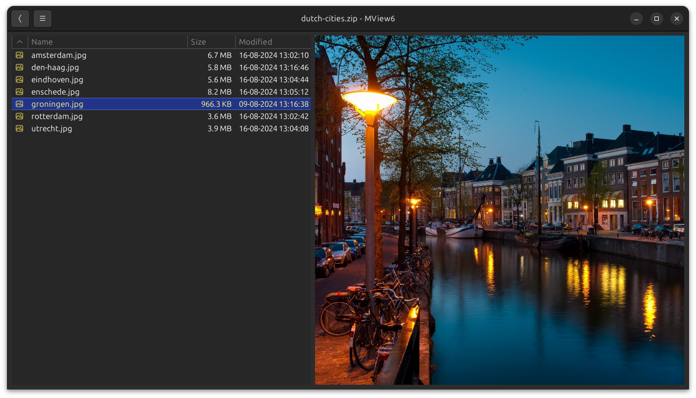
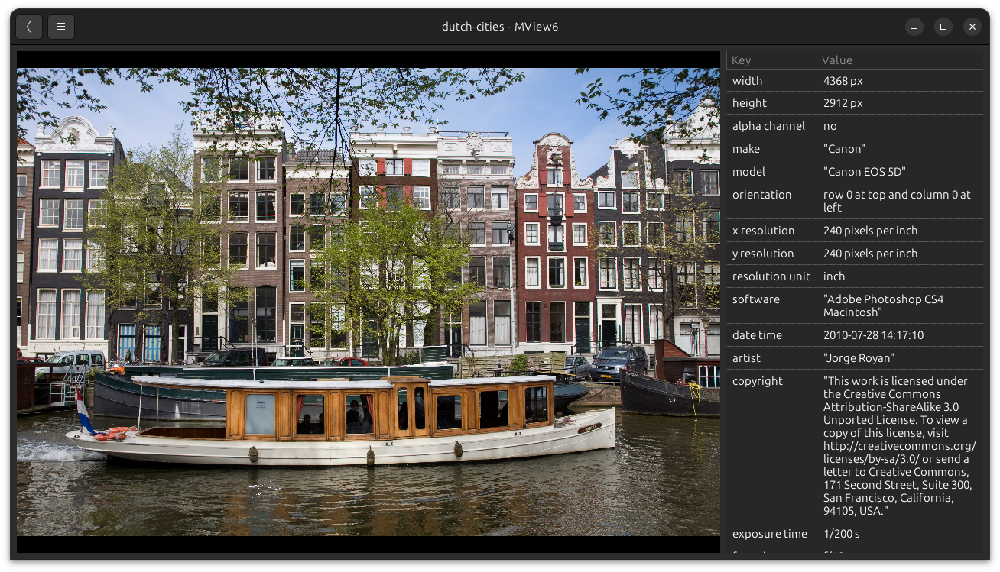
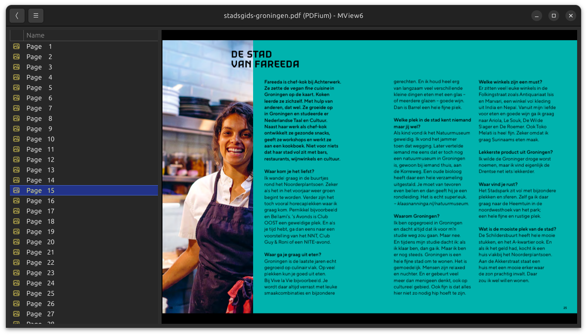
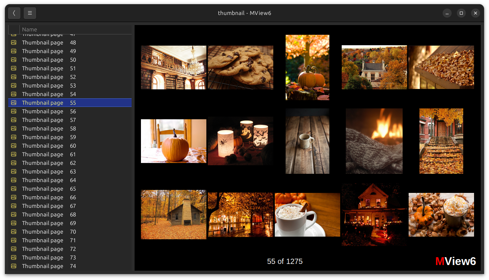
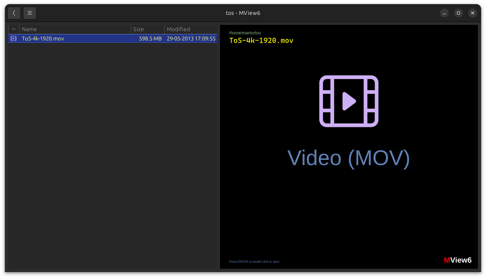
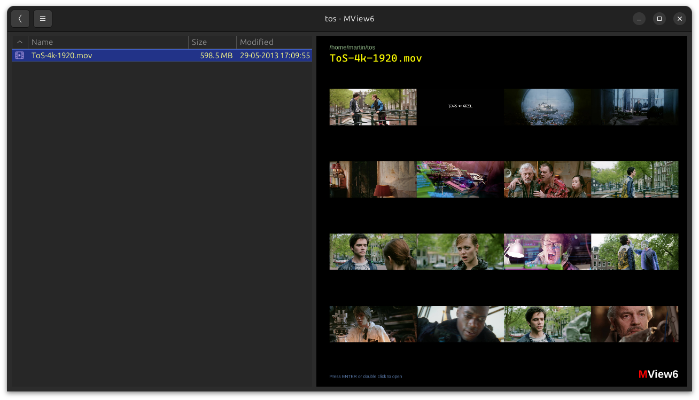
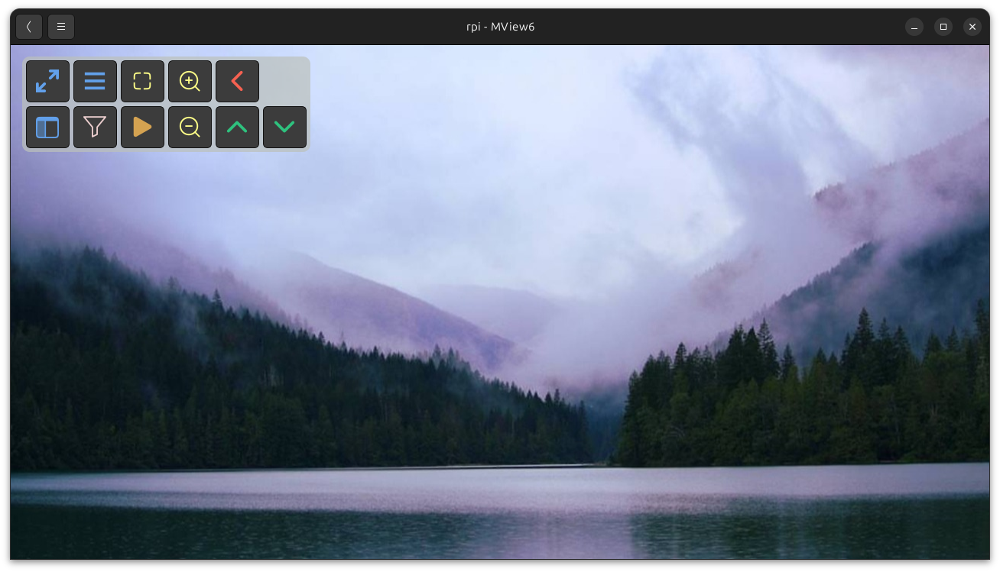
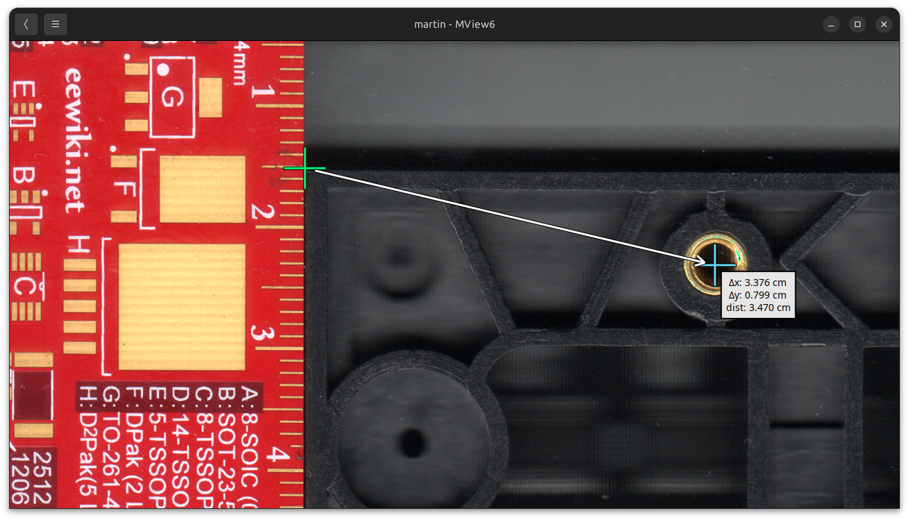
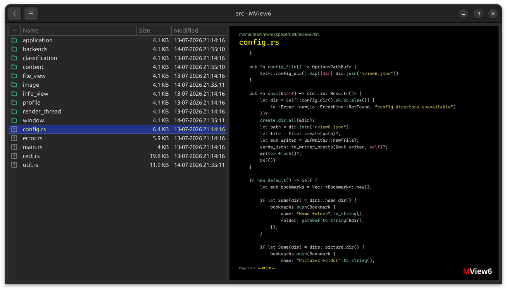
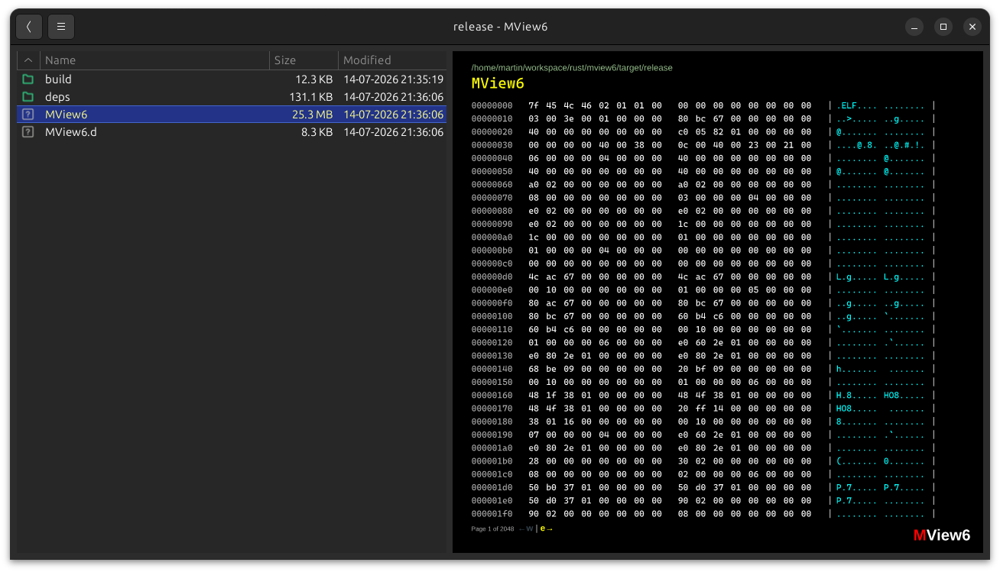

# Gallery

[Documentation index](README.md) · [Project README](../README.md)

See MView6 in action

## Browse photos inside archives

- Press `ENTER` to open archives when selected or double click in the file browser

## Photo information (EXIF)

- press `i` to toggle the info pane
- press `SPACE` to toggle the file browser

## PDF / documents

- Press `ENTER` to open documents when selected or double click in the file browser
- Press `p` to cycle through single and dual page presentations.
- Press `F8` to switch between `PDFium` and `muPDF` renderers.

## Thumbnail view

- Press `t` to open thumbnail view
- Press `m` to switch thumbnail sizes
- Click thumbnail to view image (closes thumbnail view)
- Press `BACKSPACE` to return to directory or archive

## Previews / contact sheets

- Press `c` to create preview (needs `ffprobe` and `ffmpeg` installed and in `PATH` for video)
- Previews replace the regular placeholders while browsing
- Press `ENTER` to open video player (needs `mpv` installed and in `PATH`)

While browsing, MView6 shows generic placeholders for archives, documents, and videos. Normally, you have to open these files to see what is inside. For example, a video file without a preview looks like this:

Previews let you peek inside a file without opening it:

## Touchscreen support

- When no keyboard is available you can control MView6 via the navigation pad
- Activate by clicking or touching the top-left part of the photo section
- MView6 runs on the Raspberry Pi and with an LCD screen can function as a photo frame

## Measurement tool

- Press `F2` to toggle measurement tool
- Press `TAB` to cycle through editing begin/end point or cancel
- Use mouse to fix new measurement point
- Tip: a flat-bed scanner can be used to create an image of things you want to measure, precisely and without distortion
- Currently requires image to be 600dpi

## Text files with syntax highlighting

- Use `w` and `e` to navigate pages within the text file

## Binary files with hexdump

- Use `w` and `e` to navigate pages within the hexdump

